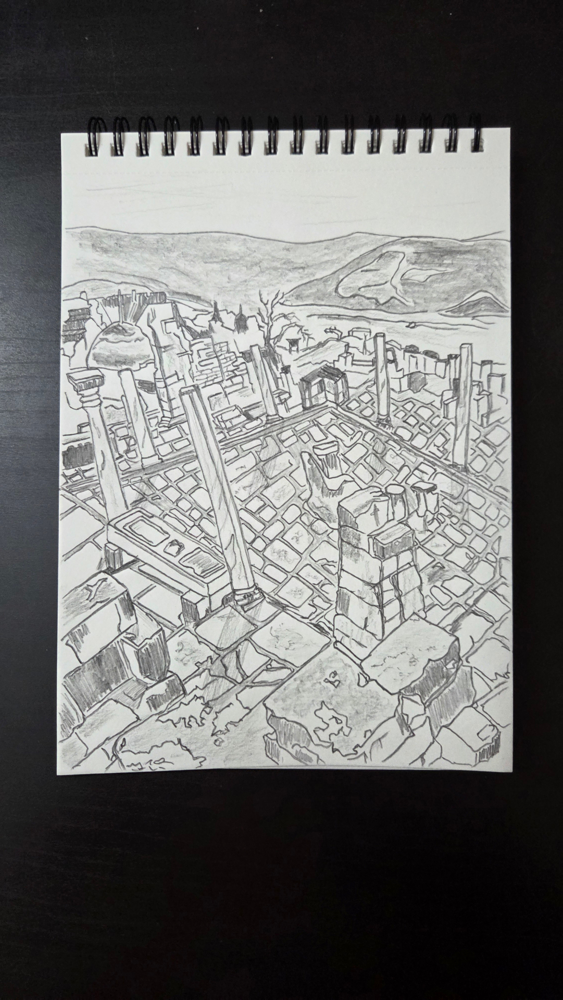
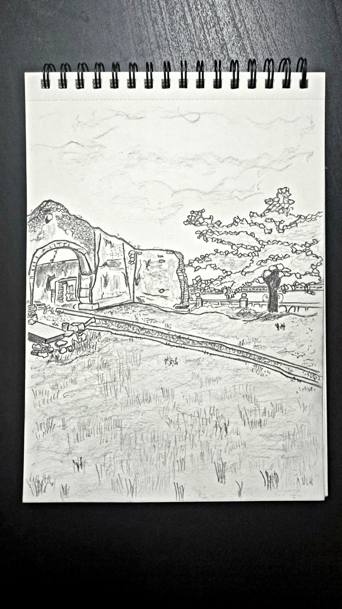
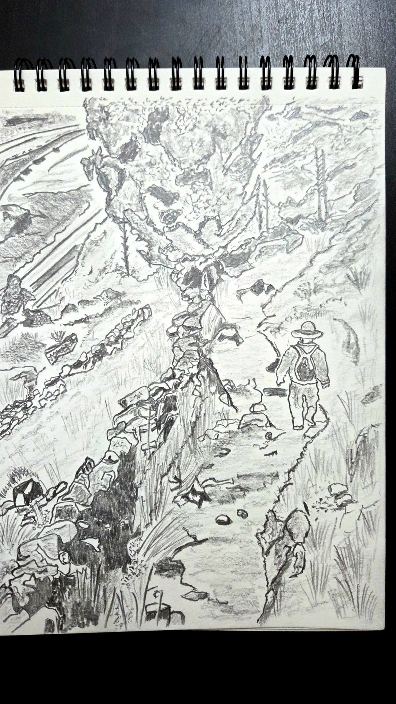

# **UNESCO World Heritage**

The UNESCO World Heritage List consists of landmarks recognized for their cultural, historical, or scientific significance, showcasing humanity’s relentless admiration, determination, and understanding of the world.

## **Motivation**

Awestruck and motivated by the sheer determination of humans to create and preserve such marvelous structures that have endured the test of time.

## **A**
> **Medium:** Paper and Pencil
>
> **Constraints:**
> 1. No ruler used
> 2. No eraser used
> 3. Only HB pencil used
>
> **Number of Sites Captured:** 11

<table width="100%">
  <tr>
    <td width="25%" style="text-align: center;">
      
    </td>
    <td width="25%" style="vertical-align: top;">
        <b>Afghanistan</b> 
        Minaret and Archaeological Remains of Jam</b> 
        (c. 1190 CE)
    </td>
  </tr>
  <tr>
    <td width="25%" style="text-align: center;">
      
    </td>
    <td width="25%" style="vertical-align: top;">
        <b>Albania</b> 
        Natural and Cultural Heritage of the Ohrid region</b> 
        (601 - 1900 CE)
    </td>
  </tr>
  <tr>
    <td width="25%" style="text-align: center;">
      
    </td>
    <td width="25%" style="vertical-align: top;">
        <b>Algeria</b> 
        Djémila</b> 
        (96 - 98 CE)
    </td>
  </tr>
  <tr>
    <td width="25%" style="text-align: center;">
      
    </td>
    <td width="25%" style="vertical-align: top;">
        <b>Andorra</b> 
        Madriu-Perafita-Claror Valley</b> 
        (1201 - 1900 CE)
    </td>
  </tr>
  <tr>
    <td width="25%" style="text-align: center;">
      
    </td>
    <td width="25%" style="vertical-align: top;">
        <b>Angola</b> 
        Mbanza Kongo, Vestiges of the Capital of the former Kingdom of Kongo</b> 
        (c. 1390 CE)
    </td>
  </tr>
  <tr>
    <td width="25%" style="text-align: center;">
      
    </td>
    <td width="25%" style="vertical-align: top;">
        <b>Antigua and Barbuda</b> 
        Antigua Naval Dockyard and Related Archaeological Sites</b> 
        (c. 1701 - 1900 CE)
    </td>
  </tr>
  <tr>
    <td width="25%" style="text-align: center;">
      
    </td>
    <td width="25%" style="vertical-align: top;">
        <b>Argentina</b> 
        Qhapaq Ñan, Andean Road System</b> 
        (c. 501 - 1525 CE)
    </td>
  </tr>
  <tr>
    <td width="25%" style="text-align: center;">
      
    </td>
    <td width="25%" style="vertical-align: top;">
        <b>Armenia</b> 
        Monastery of Geghard and the Upper Azat Valley</b> 
        (c. 401 - 1300 CE)
    </td>
  </tr>
  <tr>
    <td width="25%" style="text-align: center;">
      
    </td>
    <td width="25%" style="vertical-align: top;">
        <b>Australia</b> 
        Macquarie Island</b> 
        (c. 600000 BCE)
    </td>
  </tr>
  <tr>
    <td width="25%" style="text-align: center;">
      
    </td>
    <td width="25%" style="vertical-align: top;">
        <b>Austria</b> 
        Ancient and Primeval Beech Forests of the Carpathians and Other Regions of Europe</b> 
        (c. 10000 - 9000 BCE)
    </td>
  </tr>
  <tr>
    <td width="25%" style="text-align: center;">
      
    </td>
    <td width="25%" style="vertical-align: top;">
        <b>Azerbaijan</b> 
        Historic Centre of Sheki with the Khan’s Palace</b> 
        (c. 501 - 1797 CE)
    </td>
  </tr>
</table>